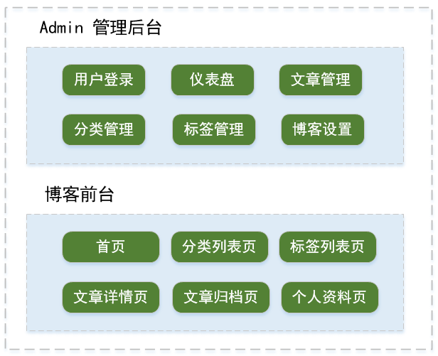
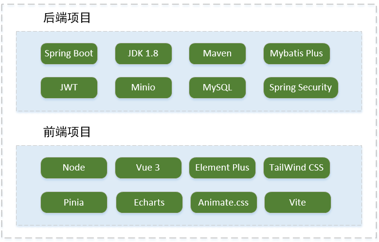
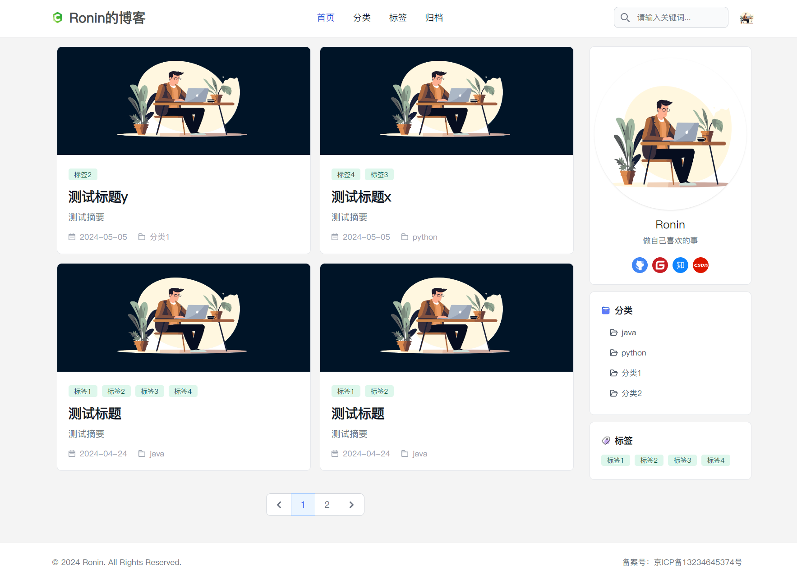
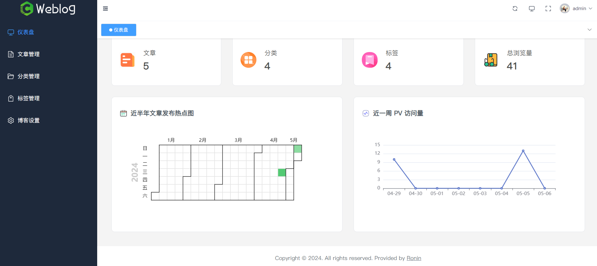

# weblog
一个基于 SpringBoot 和 Vue 的个人博客

## 介绍

weblog 是一款基于 SpringBoot 和 Vue 实现的个人博客。项目的技术栈使用了 SpringBoot2.X、Vue3 + ElementPlus，数据库使用MySQL。整个项目较为基础简单，比较适合新手学习。

### **功能模块**

### 技术栈

### 项目页面展示

- 项目前台首页展示

- Admin 后台页面展示

### **项目模块**

**weblog-vue3**：前端页面

- admin：这类文件夹下的是个人博客后台管理的页面
- fronted：这类文件夹下的是个人博客前台展示的页面

**weblog-springboot**：后端服务

- logs：日志存放文件夹
- weblog-module-admin：博客后台管理对应的后端服务
- weblog-module-common：数据库相关，工具类等公共代码模块
- weblog-module-jwt：jwt安全验证、权限访问等控制模块
- weblog-web：博客前台页面对应的后端服务

## 运行项目

## 说明

项目仅供学习使用，如有问题，请联系2538557265@qq.com。
